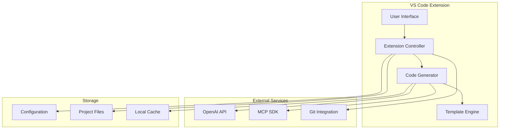
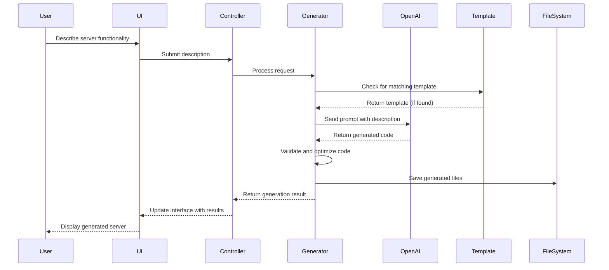
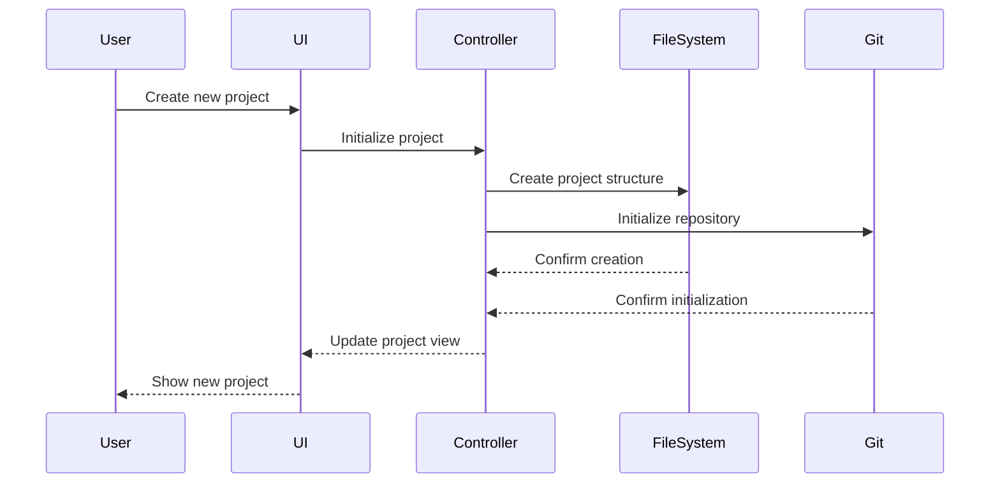
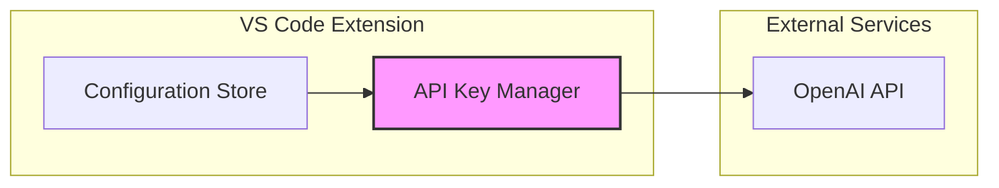
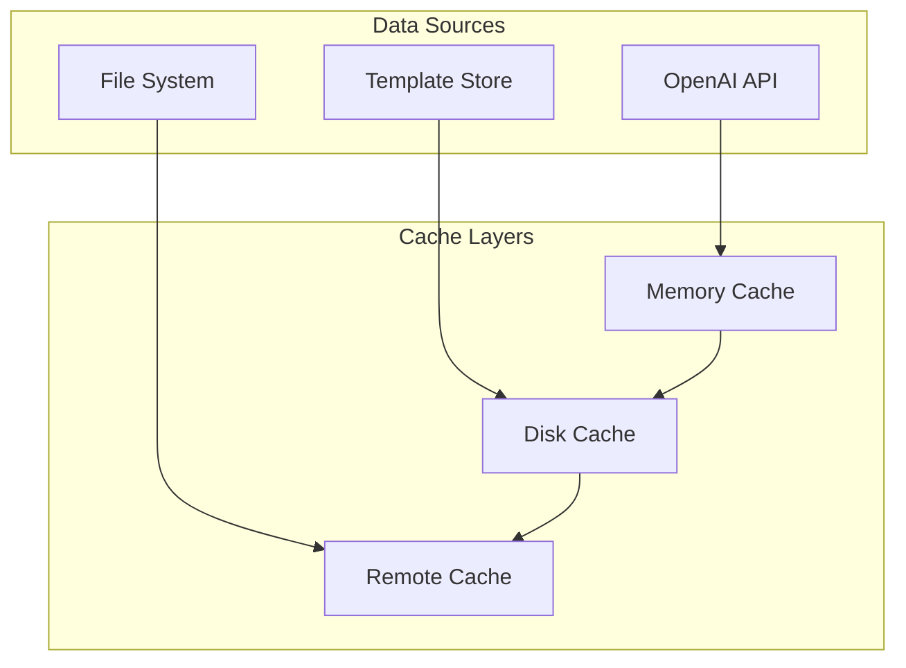
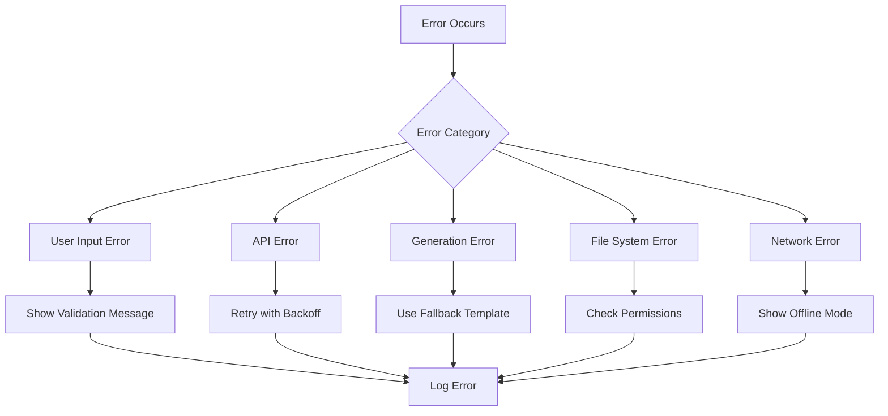
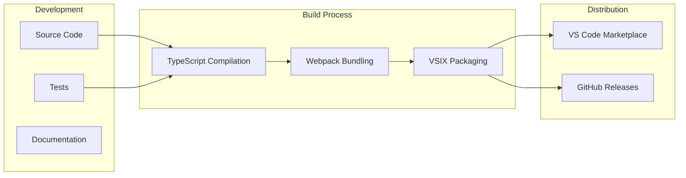

# MCP Server Builder - Architectural Design

## System Architecture Overview

The MCP Server Builder is designed as a VS Code extension that leverages AI capabilities to generate customizable MCP servers. The architecture follows a modular approach with clear separation of concerns between the UI, business logic, and external integrations.



## Core Components

### 1. Extension Controller
The main orchestrator that coordinates all extension functionality:

- **Activation/Deactivation**: Manages extension lifecycle
- **Command Registration**: Registers all VS Code commands
- **Event Handling**: Processes user interactions and system events
- **State Management**: Maintains extension state and configuration

### 2. User Interface (UI)
A webview-based interface that provides an intuitive experience:

- **Chat Interface**: Natural language input for server descriptions
- **Code Editor**: Monaco-based editor for generated code
- **Project Explorer**: File tree for generated projects
- **Configuration Panel**: Settings and preferences management

### 3. Code Generator
The AI-powered engine that transforms descriptions into functional code:

- **Prompt Engine**: Crafts effective prompts for OpenAI API
- **Response Parser**: Processes AI responses into structured code
- **Code Validator**: Validates and optimizes generated code
- **Dependency Manager**: Handles package dependencies

### 4. Template Engine
Manages templates for common MCP server patterns:

- **Template Repository**: Stores built-in and custom templates
- **Template Processor**: Renders templates with user data
- **Template Validator**: Ensures template quality and compatibility
- **Template Customizer**: Allows template modification

## Data Flow Architecture

### Code Generation Flow



### Project Management Flow



## Component Architecture

### Extension Controller Architecture

```typescript
interface ExtensionController {
  // Lifecycle management
  activate(context: ExtensionContext): void;
  deactivate(): void;
  
  // Command registration
  registerCommands(): void;
  
  // State management
  getState(): ExtensionState;
  setState(state: Partial<ExtensionState>): void;
  
  // Event handling
  handleCommand(command: string, ...args: any[]): void;
  handleEvent(event: ExtensionEvent): void;
}
```

### Code Generator Architecture

```typescript
interface CodeGenerator {
  // Generation methods
  generateFromDescription(description: string): Promise<GeneratedCode>;
  generateFromTemplate(template: Template, variables: Record<string, any>): Promise<GeneratedCode>;
  
  // Validation methods
  validateCode(code: string, language: string): ValidationResult;
  optimizeCode(code: string, language: string): string;
  
  // Template management
  findTemplate(description: string): Template | null;
  customizeTemplate(template: Template, customizations: TemplateCustomization): Template;
}
```

### UI Component Architecture

```typescript
interface UIComponents {
  // Main components
  MainPanel: React.ComponentType<MainPanelProps>;
  ChatInterface: React.ComponentType<ChatInterfaceProps>;
  CodeEditor: React.ComponentType<CodeEditorProps>;
  ProjectExplorer: React.ComponentType<ProjectExplorerProps>;
  
  // Supporting components
  StatusBar: React.ComponentType<StatusBarProps>;
  ConfigurationPanel: React.ComponentType<ConfigurationPanelProps>;
  TemplateSelector: React.ComponentType<TemplateSelectorProps>;
}
```

## Data Models

### Project Model

```typescript
interface Project {
  id: string;
  name: string;
  description: string;
  language: 'typescript' | 'javascript' | 'python';
  transport: 'stdio' | 'sse';
  createdAt: Date;
  updatedAt: Date;
  files: ProjectFile[];
  configuration: ProjectConfiguration;
  dependencies: Dependency[];
}

interface ProjectFile {
  path: string;
  content: string;
  language: string;
  isGenerated: boolean;
  isCustomized: boolean;
}

interface ProjectConfiguration {
  name: string;
  version: string;
  tools: ToolDefinition[];
  resources: ResourceDefinition[];
  environment: Record<string, string>;
}
```

### Template Model

```typescript
interface Template {
  id: string;
  name: string;
  description: string;
  category: string;
  language: 'typescript' | 'javascript' | 'python';
  files: TemplateFile[];
  variables: TemplateVariable[];
  dependencies: string[];
}

interface TemplateFile {
  path: string;
  content: string;
  isTemplate: boolean;
}

interface TemplateVariable {
  name: string;
  type: 'string' | 'number' | 'boolean' | 'object';
  description: string;
  required: boolean;
  defaultValue?: any;
}
```

## Security Architecture

### API Key Management



### Data Protection

- **Secure Storage**: API keys stored in VS Code's secure storage
- **Encryption**: Sensitive data encrypted at rest
- **Token Management**: Automatic token refresh and expiration handling
- **Request Validation**: All outgoing requests validated before sending

## Performance Architecture

### Caching Strategy



### Optimization Techniques

- **Lazy Loading**: Components loaded on demand
- **Code Splitting**: Bundles split by functionality
- **Request Batching**: Multiple requests combined when possible
- **Debouncing**: User input debounced to reduce API calls

## Error Handling Architecture

### Error Categories

1. **User Input Errors**: Invalid descriptions or configurations
2. **API Errors**: OpenAI API failures or rate limits
3. **Generation Errors**: Code generation failures
4. **File System Errors**: File access or permission issues
5. **Network Errors**: Connectivity problems

### Error Handling Flow



## Testing Architecture

### Test Layers

1. **Unit Tests**: Individual component testing
2. **Integration Tests**: Component interaction testing
3. **End-to-End Tests**: Full user journey testing
4. **Performance Tests**: Load and stress testing

### Test Organization

```
tests/
├── unit/
│   ├── controller/
│   ├── generator/
│   ├── template/
│   └── utils/
├── integration/
│   ├── api/
│   ├── filesystem/
│   └── ui/
├── e2e/
│   ├── scenarios/
│   └── fixtures/
└── performance/
    ├── load/
    └── stress/
```

## Deployment Architecture

### Extension Packaging



### Version Management

- **Semantic Versioning**: Following semver principles
- **Automated Releases**: GitHub Actions for release automation
- **Update Notifications**: In-extension update notifications
- **Backward Compatibility**: Maintaining compatibility with previous versions

## Scalability Architecture

### Horizontal Scaling

- **Stateless Design**: Components designed to be stateless where possible
- **Modular Architecture**: Features can be developed and deployed independently
- **Plugin System**: Extensible architecture for future enhancements

### Vertical Scaling

- **Resource Management**: Efficient memory and CPU usage
- **Performance Monitoring**: Built-in performance metrics
- **Resource Cleanup**: Proper cleanup of resources

## Monitoring and Observability

### Metrics Collection

- **Usage Metrics**: Feature usage statistics
- **Performance Metrics**: Response times and resource usage
- **Error Metrics**: Error rates and types
- **User Satisfaction**: Feedback collection

### Logging Strategy

- **Structured Logging**: Consistent log format
- **Log Levels**: Appropriate log levels for different scenarios
- **Log Aggregation**: Centralized log collection
- **Log Retention**: Appropriate log retention policies

## Future Architectural Considerations

### Multi-Language Support

- **Language Abstraction**: Abstracting language-specific implementations
- **Template System**: Language-agnostic template system
- **Plugin Architecture**: Language plugins for extensibility

### Cloud Integration

- **Cloud Storage**: Optional cloud storage for projects
- **Collaboration Features**: Real-time collaboration capabilities
- **Cloud Build**: Cloud-based build and deployment

### AI Model Evolution

- **Model Abstraction**: Abstracting AI model implementations
- **Multiple Providers**: Support for multiple AI providers
- **Local Models**: Support for local AI models